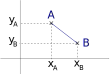

Activité
========

En sciences, dans le traitement des données, il est fréquent d'associer des grandeurs et les représenter graphiquement. Chaque point du graphique a une abscisse associée à l'une des grandeurs et une ordonnée associée à l'autre grandeur.

Quelle structure de données en Python peut convenir pour représenter ces points?

La classe Point
---------------

#. Il existe en python un type de donnée appelé ``class`` qui construit des **objets**. Cette classe regroupe les différentes valeurs appelées **attributs** de l'objet. Par exemple, une classe ``Point`` contient l'attribut **abscisse** et l'attribut **ordonnée**.

   Pour créer un objet avec ses différents attributs, il faut définir dans la classe un constructeur. 
   
   Ce constructeur est la **fonction** ``__init__`` qui contient au minimum le paramètre ``self`` et eventuellement d'autres paramètres associés aux attributs de l'objet créé.

   Voici le code python de la classe ``Point``:

   .. literalinclude:: ../python/objet_point.py
      :lines: 3-9

   a. Recopier le code de cette classe dans un fichier python nommé ``objets.py``.
   b. En console, l'instruction ``A = Point(1,2)`` construit un objet nommé ``A`` qui a 2 attributs ``x`` de valeur ``1`` et ``y`` de valeur ``2``. 
   
      Construire le point ``B(3,4)``.

#. Le paramètre ``self`` désigne un objet en général. Lorsqu'un objet est construit, le paramètre ``self`` est remplacé par le nom de l'objet. On accède et on modifie les valeurs des attributs d'un objet en les préfixant par le nom de l'objet. Par exemple, on modifie l'abscisse du point B avec l'instruction:

   >>> B.x = 7
   
   a. Modifier les coordonnées du point B en les remplaçant par les coordonnées ``(4,-2)``.
   b. Écrire une fonction ``affiche`` qui prend en paramètre un point et affiche les coordonnées de ce point.

#. On calcule la distance [1]_ entre 2 points A et B avec la formule mathématique :math:`\sqrt{(x_A-x_B)^{2}+(y_A-y_B)^{2}}` [2]_.

   Écrire en python la fonction ``distance`` qui prend en paramètre 2 points et renvoie la distance entre ces 2 points, arrondie à 2 chiffres après la virgule.

   .. note::

      #. La racine carrée se calcule avec la fonction ``sqrt`` du module ``math`` qu'il faut importer.
      #. La fonction ``round(v,n)`` arrondit la valeur ``v`` passée en argument avec ``n`` chiffres après la virgule. La valeur renvoyée est donc de type ``float``.

#. En l'état, il n'est pas possible d'afficher le nom de l'objet. Un moyen est donc de créer un attribut qui sera associé au nom du point.

   a. Ajouter l'attribut ``nom`` à la classe ``Point``.
   b. Après avoir apporté les modifications nécessaires, recréer les points A et B puis afficher ces points avec leurs noms!

La classe Segment
-----------------

Un segment est la partie de droite comprise entre 2 points. 

La classe ``Segment`` représente un segment qui a pour extrémités 2 points, c'est à dire 2 objets de la classe ``Point``. Cela signifie que chaque objet ``Segment`` a deux attributs ``ext1`` et ``ext2`` correspondant à 2 objets de la classe Point.

#. Écrire en python la classe ``Segment`` et son constructeur qui prend en argument 2 objets de la classe Point. Par exemple, avec les points A et B on construit le segment AB.

   >>> AB = Segment(A,B)

#. Une classe peut contenir des fonctions. C'est déjà le cas avec la fonction ``__init__`` qui est le constructeur de l'objet. Les fonctions contenues dans une classe s'appellent des **méthodes** et sont utilisables uniquement sur les objets de la classe et pas autrement.

   a. En reprenant le code de la fonction distance, ajouter à la classe ``Segment`` la méthode ``longueur`` qui a pour unique paramètre ``self``. Cette méthode renvoie la longueur du segment.
   b. Après avoir créer le segment AB, calculer sa longueur avec la methode dédiée.
   
.. [1] le calcul d'une distance entre 2 points d'un repère n'est possible que si le repère utilisé est **orthonormé** mais cela dépasse le cadre de ce cours et donc on admet que de telles conditions sont réunies.
.. [2] l'ordre des abscisses et des ordonnées des points A et B n'a pas d'importance car :math:`(x_A-x_B)^{2}=(x_B-x_A)^{2}`.