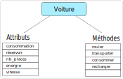

Activité
========

Une automobile est un objet motorisé qui a pour but de transporter des personnes. Il en existe de nombreux modèles fabriqués par de nombreux constructeurs. En dépit de cela, des caratéristiques et des fonctionnalités sont communes à toutes les automobiles. On peut dire qu'il existe un modèle initial qui est répliqué et modifié par les constructeurs.

On définit ainsi le concept d'objet. Un modèle initial commun qui donnera des objets avec des caractéristiques différentes mais les mêmes fonctionnalités.

Ce concept s'applique aussi en informatique. Les caractéristiques de l'objet sont des **attributs** et les fonctionnalités communes aux objets sont des **méthodes**.

Les objets en Python
--------------------

En Python un objet est créé avec le mot clé ``class``. Dans la classe, tout est indenté et on y retrouve les attributs et les méthodes.

.. code:: python

   class Voiture:
       
       # attributs
              
       consommation = ...
       reservoir = ...
       nb_places = ...
       energie = ...
       
       # méthodes
       
       def consommer(self, distance):
           pass
           
       def rouler(self, distance):
           pass
           
       def transporter(self,n):
           pass
           
1. Quelles valeurs initiales peut-on donner aux attributs ?
2. Reproduire le code de la classe ``Voiture`` en initialisant les attributs.
3. La création d'un objet nommé ``v`` se fait par une simple affectation:
   
   .. code:: python
   
      v = Voiture()
      
   Créer deux objets Voiture nommés ``polo`` et ``tesla``.
4. L'accès aux attributs d'un objet se fait en suivant la syntaxe ``nom_objet.attribut``.
   Afficher les attributs des 2 objets ``polo`` et ``tesla``.
   
5. On peut modifier les valeurs des attributs en faisant une affectation : ``nom_objet.attribut = nouvelle_valeur``. Modifier les attributs des objets ``polo`` et ``tesla`` pour que ce soit correct.

Les méthodes des objets
-----------------------

Quel que soit l'objet construit, une méthode s'applique de la même façon. Elle peut modifier les valeurs des attributs de l'objet, renvoyer des informations sur l'objet, réaliser des affichages, etc.

Une méthode qui utilise un attribut de l'objet doit le faire précéder du mot clé ``self`` pour y avoir accès selon la syntaxe ``self.attribut``. Toute opération effectuée sur un attribut le modifie au sein de l'objet.

1. Comment sont définies les méthodes d'un objet ? Quel est le rôle du paramètre ``self`` ?

2. La méthode ``consommer`` prend en paramètre une distance à parcourir. Elle calcule l'enérgie consommée pour effectuer la distance passée en argument. La méthode renvoie l'ernergie consommée.

3. La méthode ``rouler`` prend en paramètre une distance à parcourir. Lorsque la distance est parcourue, le réservoir s'est vidé. La méthode ajuste donc la quantité d'energie qui reste dans le réservoir.

4. La méthode ``transporter`` prend en paramètre un nombre ``n`` de personnes et renvoie un booléen qui permet de savoir si la Voiture peut transporter ou non ces personnes.

5. Ajouter la méthode ``afficher`` qui affiche les valeurs de tous les attributs de l'objet en précisant pour chacun à quoi il correspond.

Une méthode spéciale
--------------------

Chaque fois qu'un nouvel objet est créé, il a les mêmes valeurs d'attributs que celles données dans la classe. Il est donc nécessaire de les modifier à posteriori, ce qui n'est pas optimal.

Il existe une méthode appelée **constructeur** qui permet d'attribuer des valeurs aux attibuts lors de la création de l'objet. C'est la méthode ``__init__`` (double soulignés autour de init) dont la syntaxe générale est donnée:

.. code:: python

   def __init__(self, p1, p2, ...):
       self.attribut1 = p1
       self.attribut2 = p2
       ...

1. Combien de paramètres faut-il prévoir pour la méthode ``__init__`` pour construire nos objets?

2. Remplacer dans votre script la déclaration des attributs par la méthode ``__init__``.

3. Vérifiez que vous pouvez construire les objets ``polo`` et ``tesla`` en saisissant les bons arguments.
