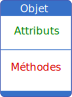

Programmation orientée objet (POO)
==================================

Le paradigme de **programmation orientée objet** est une forme de programmation basée sur des objets que l'on crée. Chaque **objet** est créé à partir d'un modèle. Ces objets sont des représentations de ce modèle.

Le modèle qui sert à la création d'un objet définit:

- des **attributs** qui permettent de stocker des valeurs créant une structure de donnée;
- des **méthodes** qui sont des fonctions qui permettent d'agir sur l'objet et ses attributs.

Objet en Python
---------------

En python, un objet est défini par le mot clef ``class`` suivi du nom de l'objet et des 2 points.

- Une **classe** est une structure de donnée qui permet de créer des objets.     
- Une **classe** permet de définir les attributs d'un objet et les méthodes qui lui sont propres.

.. literalinclude:: ../python/automobile.py
   :lines: 1-4

.. warning::
   
   - Tout ce qui est défini dans la classe doit être **indenté**.
   - Par convention, les noms de classe commencent par une majuscule.

.. admonition:: Définition

   La création d'un objet se fait par une affectation avec la classe définissant l'objet. On dit qu'on **instancie** un objet.

.. admonition:: Exemple

   Imaginons que l'on souhaite créer un objet en python représentant une voiture. On peut définir les attributs et les méthodes de notre objet comme suit:

   - Les attributs sont des caractéristiques ou des propriétés de la voiture: le nombre de roues, la marque, le modèle, le nombre de portes, la couleur, etc.
   - les méthodes représentent des fonctionnalités ou des actions: avancer, accélérer, démarrer, ralentir, etc.

   Pour créer nos objets voitures, on définit la classe ``Automobile``:

   .. code-block:: python
   
      class Automobile:
          pass # instruction qui ne fait rien mais évite une erreur dans l'interpréteur

   Dans l'interpréteur ou le notebook, on peut créer différentes voitures:

   .. code:: python
   
      v_1 = Automobile()
      v_2 = Automobile()

.. hint::

   Les variables ``v_1`` et ``v_2`` sont 2 **instances d'objets** construites avec la classe ``Automobile``. On fait souvent le raccourci que ``v_1`` et ``v_2`` sont deux **objets** de la classe ``Automobile``.

Les attributs d'un objet
------------------------

Les **attributs** d'un objet permettent de stocker des valeurs pour notre objet. Ces attributs sont accessibles et peuvent être modifiés. 

Pour créer des attributs, on définit un **constructeur** qui est une fonction appelée quand on instancie un nouvel objet. Ce constructeur est la fonction ``__init__`` contenant le paramètre obligatoire ``self`` .

.. code-block:: python

   class Objet:

       # Constructeur
       def __init__(self):
           self.attribut_1 = valeur_1
           self.attribut_2 = valeur_2
           ...
           self.attribut_n = valeur_n

.. note::

  - On peut définir autant d'attributs qu'on le souhaite;
  - Tous les objets créés ont les mêmes attributs ce qui rend la structure plus cohérente;
  - Un objet définit une structure de données.

.. admonition:: Exemple

   En reprenant notre classe ``Automobile``, on peut donc y ajouter le constructeur définissant le modèle et le nombre de portes.

   .. literalinclude:: ../python/automobile.py
      :lines: 10-17

   >>> v=Automobile() # on instancie un objet v
   >>> v.modele
   'clio'
   >>> v.nombre_portes
   3

On remarque tout de suite un problème. Chaque nouvel objet créé est toujours de modèle **clio** et a **3 portes**. Cela implique de modifier les valeurs des attributs après la création pour un modèle différent!

Pour éviter cela, le constructeur étant une fonction, on ajoute des paramètres. Les paramètres sont alors associés aux attributs de l'objet:

.. code-block:: python

   class Objet:

       # Constructeur
       def __init__(self,parametre_1,parametre_2,...,parametre_n):
           self.attribut_1 = parametre_1
           self.attribut_2 = parametre_2
           ...
           self.attribut_n = parametre_n

.. admonition:: Exemple

   En reprenant notre classe ``Automobile``, on peut ajouter les paramètres pour le modèle et le le nombre de portes.

   .. literalinclude:: ../python/automobile.py
      :lines: 20-27

   >>> v_1=Automobile('clio',3)
   >>> v_2=Automobile('golf',5)
   >>> v_1.modele
   'clio'
   >>> v_2.modele
   'golf'

Les méthodes d'un objet
-----------------------

Les méthodes sont des fonctions propres aux objets, ce qui implique que la fonction ne peut être appliquée qu'à l'objet. Comme l'attribut, la méthode est appelée en utilisant la notation pointée : ``objet.méthode()``.

.. rubric:: Méthode en python

En python, une méthode d'objet est définie dans la classe. Pour faire référence à l'objet, nous devons utiliser le mot clé **self** qui désigne l'objet. Ce mot clé **self** est passé en paramètre.

.. code-block:: python

   class Objet:

       # Constructeur
       def __init__(self,parametre_1,parametre_2,...,parametre_n):
           self.attribut_1 = parametre_1
           self.attribut_2 = parametre_2
           ...
           self.attribut_n = parametre_n
       
       # Méthode
       def ma_methode(self):
           # modifier un attribut
           self.attribut_1 = self.attribut_1 + 1
           
           # afficher un attribut
           print(self.attribut_2)

           # renvoie d'une valeur
           return self.attribut_3, self.attribut_4

.. admonition:: Exemple

   Reprenons l'exemple de la classe ``Automobile`` et créons une méthode pour savoir si la voiture avance. Pour cela, on ajoute un attribut ``vitesse`` initialisé avec la valeur ``0``.

   .. literalinclude:: ../python/automobile.py
      :lines: 30-47

   #. On crée un objet ``v_1`` et on applique la méthode ``avance``:

      >>> v_1 = Automobile("clio",3)
      >>> v_1.avance()
      False

   #. On modifie la vitesse et on applique la méthode ``avance``:

      >>> v_1.vitesse = 50
      >>> v_1.avance()
      True

.. note::

   Une classe peut contenir de nombreuses méthodes. Ces méthodes sont des fonctions propres aux objets. Elles ne peuvent être appelées que par les objets créés par la classe contenant les méthodes. 

.. rubric:: Méthode avec paramètres

Une méthode est une fonction, donc on peut ajouter des paramètres à celle-ci.

.. code-block:: python

   class Objet:

       # constructeur
       def __init__(self):
           ...

       # Méthode
       def ma_methode_avec_parametres(self,p1,p2):
           
           self.attribut_1 = self.attribut_1 + p1
           if p2 <= 0:
               self.attribut_2 = 0
           else:
               self.attribut_2 = self.attribut_2 * p2

.. admonition:: Exemple

   Dans la classe ``Automobile``, on crée une méthode ``ralentir`` qui diminue la vitesse de la voiture d'une valeur donnée en paramètre.

   .. literalinclude:: ../python/automobile.py
      :lines: 50-72

   #. On crée un objet ``v_1`` et on applique la méthode ``avance``:

      >>> v_1 = Automobile("clio",3)
      >>> v_1.avance()
      False

   #. On modifie la vitesse et on applique la méthode ``avance``:

      >>> v_1.vitesse = 50
      >>> v_1.avance()
      True

   #. On diminue la vitesse en appliquant la méthode ``ralentir``:

      >>> v_1.ralentir(20)
      >>> print(v_1.vitesse)
      30
