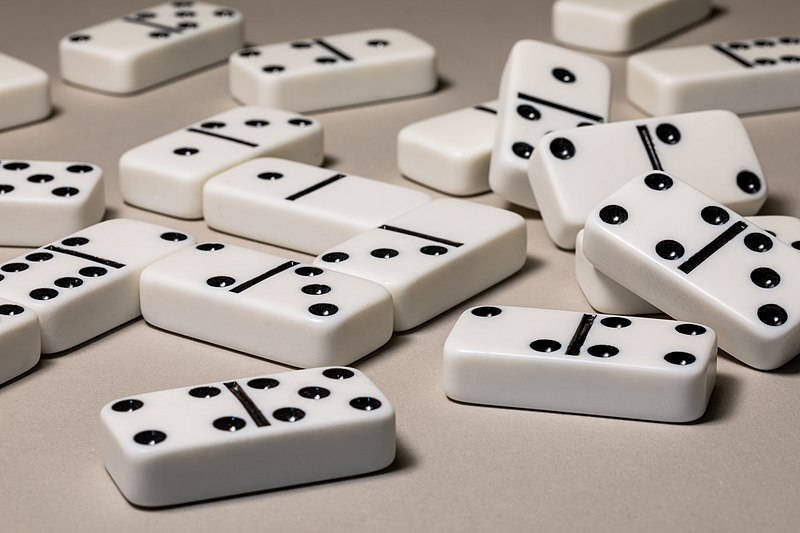
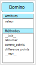
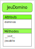
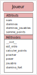
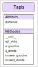

.. TNSI

.. toctree::
   :maxdepth: 1
   
Projet POO
==========

Objectif
--------

   
Le jeu de dominos est constitué de 28 pièces. Une pièce de domino est en deux parties. Chaque partie contient de 0 à 6 points. Lorsque les deux parties ont le même nombre de points, les dominos sont doubles. Il y a 7 doubles dans un jeu : du double 0 au double 6.

Le jeu se joue de 2 à 4 joueurs. 

- S'il y a 2 ou 3 joueurs, chaque joueur pioche 7 dominos. Il reste 14 ou 7 dominos dans la pioche.
- S'il y a 4 joueurs, chaque joueur pioche 6 dominos. Il reste 4 dominos dans la pioche.

Au début de la partie, le joueur qui a le domino le plus fort commence à jouer en posant un domino sur le tapis. Ensuite, les autres joueurs posent chacun leur tour un domino en les faisant coincider. Si un joueur ne pas jouer, il pioche ou passe son tour si la pioche est vide.

On va représenter ce jeu de dominos en POO. Voici la liste des classes que l'on va utiliser:

1. La classe ``Domino`` qui construit un objet domino.
2. La classe ``JeuDomino`` qui construit un objet contenant les 28 dominos.
3. La classe ``Tapis`` qui contient les dominos posés par les joueurs.
4. La classe ``Joueur``.

La classe Domino
----------------

La classe Domino a un seul attribut ``valeur`` et 5 méthodes.

L'attribut ``valeur`` est une liste contenant le nombre de points de chaque partie d'un domino.

Les méthodes de cette classe sont:

1. ``__init__`` constructeur qui initialise l'attribut ``valeur`` avec une liste dont les valeurs sont passées en paramètres.
2. ``retourner`` qui retourne le domino et donc modifie l'attribut ``valeur``.
3. ``somme_points`` qui renvoie la somme des points du domino.
4. ``difference_points`` qui renvoie la différence positive des points du domino.
5. ``__repr__`` qui affiche le domino. Par exemple ``[a|b]``

On donne ci-dessous le code de la classe à compléter:

.. literalinclude:: ../python/tp_domino/jeu_domino_a_remplir.py
   :lines: 3-19

La classe JeuDomino
-------------------

La classe JeuDomino a un seul attribut ``valeur`` et 2 méthodes.

L'attribut ``valeur`` est une liste contenant les 28 dominos du jeu. Chaque domino est un objet ``Domino``.

Les méthodes de cette classe sont:

1. ``__init__`` constructeur qui initialise l'attribut ``dominos`` avec une liste dont les valeurs sont les 28 dominos du jeu.
2. ``jouable`` qui retourne un booléen pour savoir si la partie est jouable. Cela signifie :

   - La partie est encore jouable si la pioche est non vide, les joueurs ont encore des dominos et qu'ils peuvent en poser au tapis.
   - La partie n'est plus jouable, donc finie, si la pioche est vide, un joueur a posé tous ses dominos ou aucun joueur ne peut poser de dominos.

On donne ci-dessous le code de la classe à compléter:

.. literalinclude:: ../python/tp_domino/jeu_domino_a_remplir.py
   :lines: 20-27

La classe Joueur
----------------

La classe Joueur a 4 attributs et 7 méthodes.

- L'attribut ``nom`` contient le nom du joueur
- L'attribut ``dominos`` est une liste qui contient les dominos du joueur
- L'attribut ``dominos_jouables`` est une liste qui contient les dominos que le joueur peut poser sur le tapis.
- L'attribut ``somme_points`` est un nombre entier égal à la somme des points des dominos du joueur.

Les méthodes de cette classe sont:

1. ``__init__`` constructeur qui initialise les attributs.
2. ``est_vide`` qui retourne un booléen pour savoir si le joueur a encore des dominos dans son jeu.
3. ``calculer_points`` modifie l'attribut ``somme_points`` et retourne la somme des points des dominos du joueur.
4. ``piocher`` ajoute un domino au joueur. La pioche est l'attribut ``dominos`` de la classe ``JeuDomino``.
5. ``poser`` ajoute au tapis un domino du joueur en faisant correspondre les points des dominos accolés.
6. ``jouable`` modifie l'attribut ``dominos_jouables`` et retourne la liste des dominos du joueur suceptibles d'être posés au tapis.
7. ``domino_fort`` retourne le domino qui a la plus grande valeur parmi une liste de dominos. La plus forte valeur d'un domino peut être déterminée par la plus grande somme des points d'un domino et en même temps la plus petite différence entre les points.

On donne ci-dessous le code de la classe à compléter:

.. literalinclude:: ../python/tp_domino/jeu_domino_a_remplir.py
   :lines: 28-53

La classe Tapis
----------------

La classe Joueur a 1 attribut ``dominos`` et 6 méthodes.

L'attribut ``dominos`` contient les dominos posés par les joueurs.

Les méthodes de cette classe sont:

1. ``__init__`` constructeur qui initialise l'attribut ``dominos`` par une liste vide.
2. ``est_vide`` qui retourne un booléen pour savoir si le tapis est vide ou non.
3. ``a_gauche`` qui retourne le domino situé à gauche du tapis.
4. ``a_droite`` qui retourne le domino situé à droite du tapis.
5. ``inserer_gauche`` qui ajoute un domino à gauche sur le tapis.
6. ``inserer_droite`` qui ajoute un domino à droite au tapis.

On donne ci-dessous le code de la classe à compléter:

.. literalinclude:: ../python/tp_domino/jeu_domino_a_remplir.py
   :lines: 54-73

Le programme principal
----------------------

Le programme doit dérouler une partie de dominos entre des joueurs jusqu'à avoir un gagnant.

Voici quelques remarques sur ce programme:

- Créer des joueurs. On peut se limiter à 2 joueurs (au moins au début)
- Créer un jeu de dominos (partie)
- Créer un tapis pour le jeu

Une boucle de jeu se déroule tant que la partie est jouable:

- Les joueurs posent leurs dominos chacun leur tour
- Si un joueur ne peut pas jouer, il pioche ou passe son tour si la pioche est vide
- Si un des joueurs n'a plus de dominos, la partie s'arête
- Si les joueurs ne peuvent plus poser de dominos ni piocher, la partie s'arête

A la fin de la partie, on affiche le gagnant. Si les joueurs ont encore des dominos mais ne pauvent plus joueur ni piocher, le vainqueur est celui qui a le plus petit nombre de points avec ces dominos.

Pendant le déroulement du jeu, on effectuera des affichages. Par exemple :

- Le nom du joueur qui joue
- Le tapis après qu'un ait joué
- Les dominos de chaque joueur

Il est possible de proposer d'autre méthodes et d'autres attributs pour réaliser ce jeu mais il faudra être en mesure de justifier les choix et surtout les raisons de ces choix.
